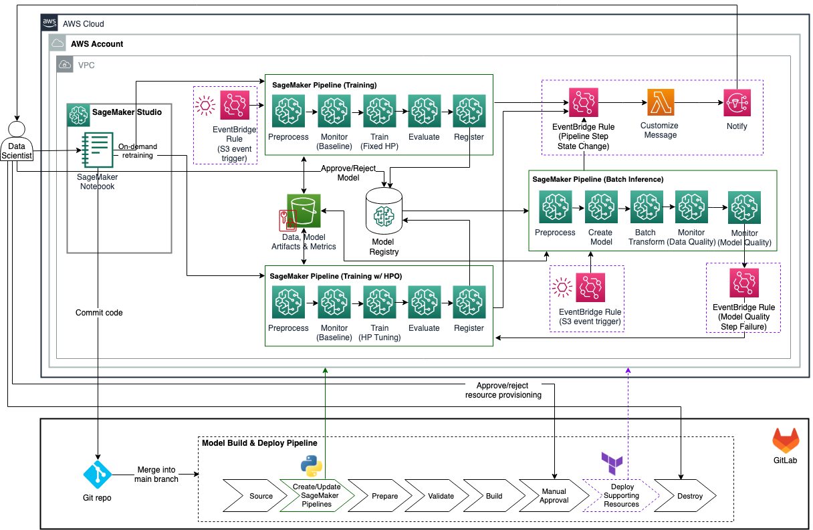

# MLOps for Batch Inference with Amazon SageMaker, HashiCorp Terraform, and GitLab CI/CD
This repository provides an illustrative example of creating an MLOps workflow to manage batch inference workloads in production, including data/model monitoring and automatic re-training.

You'll find:

- Details of the MLOps pipeline components with SageMaker, Terraform, and GitLab CI/CD.
- A  demonstration of Infrastructure as Code (IaC) with Terraform.
- A structured repository with scripts and data directories for easy reference.

## Prerequisites
Before proceeding with the usage of this repository, ensure that you meet the following prerequisites:

-	An AWS account
-	Amazon SageMaker Studio 
-	SageMaker execution role with S3 read/write and KMS encrypt/decrypt permissions
-	One S3 bucket for storing data, scripts, and model artifacts
-	Terraform version 0.13.5 or greater
-	GitLab with a working docker runner for pipeline execution
-	AWS CLI 
-	jq
-	unzip
-	Python3 (Python 3.7 or greater) and the following Python packages:
    -	boto3
    -	sagemaker 
    -	pandas
    -	pyyaml

## Architecture Diagram
The figure below depicts the architecture diagram for the solution in this repository.

## Variables and Configuration
The table below shows the variables that are used to parameterize this solution.

| Name | Description | Type | Default |
|------|-------------|------|---------|
|bucket_name|An existing s3 bucket that is used to store data, scripts, and model artifacts|String|N/A|
|bucket_prefix|S3 prefix for the ML project|String|N/A|
|bucket_train_prefix|S3 prefix for training data|String|N/A|
|bucket_inf_prefix|S3 prefix for inference data|String|N/A|
|notification_function_name|Name of the Lambda function that prepares and sends notification messages about SageMaker Pipelines step state change|String|N/A|
|custom_notification_config|The configuration for customizing notification message for specific SageMaker Pipelines steps when a specific pipeline execution status is detected|String|N/A|
|email_recipient|The email address list for receiving SageMaker Pipelines step state change notification|List(String)|N/A|
|pipeline_inf|Name of the SageMaker inference pipeline|String|InferencePipeline|
|pipeline_train|Name of the SageMaker training pipeline|String|TrainingPipeline|
|pipeline_trainwhpo|Name of SageMaker training pipeline with HPO|String|TrainingWHPOPipeline|
|recreate_pipelines|If set to true, the 3 existing SageMaker Pipelines (training, inference, training with HPO) will be deleted and new ones will be created when GitLab CICD is run|Bool|true|
|model_package_group_name|Name of the model package group|String|N/A|
|accuracy_mse_threshold|Maximum value of MSE before requiring an update to the model|Float|10.00|
|role_arn|The IAM role ARN of the SageMaker pipeline execution role|String|N/A|
|kms_key|KMS key ARN for S3 and SageMaker encryption|ARN|N/A|
|subnet_id|Subnet ID for SageMaker networking configuration|String|N/A|
|sg_id|Security Group Id for SageMaker networking configuration|String|N/A|
|upload_training_data|If set to true, training data will be uploaded to S3, and this upload operation will trigger the execution of the Training Pipeline|Bool|true|
|upload_inference_data|If set to true, inference data will be uploaded to S3, and this upload operation will trigger the execution of the Inference Pipeline|Bool|false|
|user_id|The employee ID of the SageMaker user which is added as a tag to SageMaker resources|String|N/A|

## Solution Deployment

Follow these steps to deploy the solution in your AWS account:

1.	Clone the GitHub repository into your workspace. 
2.	Review and modify the GitLab CICD pipeline configuration to suit your environment. The configuration is specified in the `./gitlab-ci.yaml` file. 
3.	Update the general solution variables in the `./env_files/dev_env.tfvars` file. This file contains variables for both Python scripts and Terraform automation.

        a. Check the additional SageMaker Pipelines parameters that are defined in the YAML files under "./batch_scoring_pipeline/pipeline_scripts". Review and update the parameters if necessary.

4.	Review SageMaker Pipelines creation scripts in `./pipeline_scripts/` as well as the scripts that are referenced by them in `./scripts/` folder. The example scripts provided in this repo are based on the [Abalone dataset](https://archive.ics.uci.edu/dataset/1/abalone). If you are going to use a different dataset, ensure you update the scripts to suit your particular problem. 

5.	Put your data files into the `./data` folder following the below naming convention. If you are using the Abalone dataset along with the provided example scripts, ensure the data files are headerless, the training data include both independent and target variables with the original order of columns preserved, the inference data only include independent variables, and the ground truth file only include the target variable. 
    
        a. training-data.csv
        b. inference-data.csv
        c. ground-truth.csv

6.	Commit and push the code to the repository to trigger the GitLab CICD pipeline run (1st run).

        a.	Note: The first pipeline run will fail on the “pipeline” stage since there’s no approved model version yet for the inference pipeline script to use. Review the step log and verify a new SageMaker Pipeline named "Training Pipeline" has been successfully created.   

        b.	Open SageMaker Studio UI, review and execute the Training Pipeline. 
        
        c.	After the successful execution of the "Training Pipeline", approve the registered model version in SageMaker Model Registry; and re-run the entire GitLab CI/CD pipeline.
7.	Review the Terraform plan output in the build stage. Approve the manual `apply` stage in the GitLab CICD pipeline to resume the pipeline execution and authorize Terraform to create the monitoring and notification resources in your AWS account.
8.	Finally review the SageMaker pipelines execution status and output in the SageMaker Studio UI and check your email for notification messages. The default message body is in JSON format.

# Clean Up
Upon concluding your exploration of this solution, you can clean up the resources by following these steps: 

1.	Employ the `destroy` stage in the GitLab CI/CD pipeline to eliminate all resources provisioned by Terraform.
2.	Utilize the AWS CLI to `list` and `remove` any remaining pipelines that are created by the Python scripts.
3.	(Optional) Delete other AWS resources such as the S3 bucket or IAM role created outside the CI/CD pipeline.

## Security

See [CONTRIBUTING](CONTRIBUTING.md#security-issue-notifications) for more information.

## License

This sample code is made available under the MIT-0 license. See the LICENSE file.

